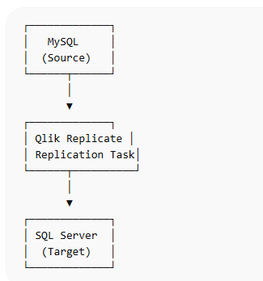
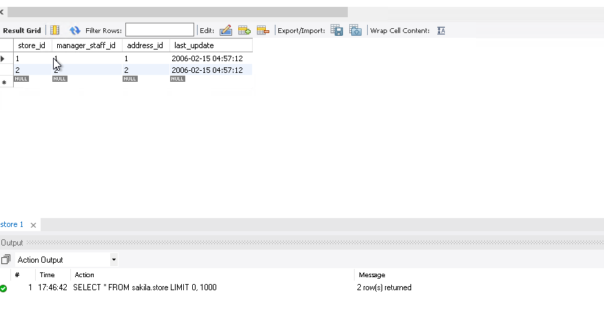
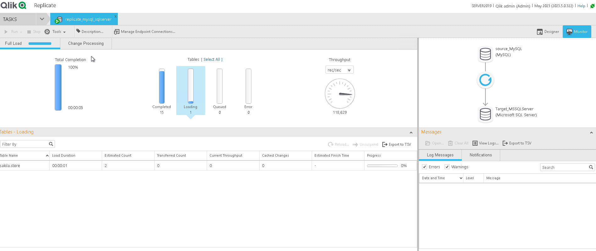

Data Replication Lab — MySQL → SQL Server using Qlik Replicate
📌 Overview

Este projeto demonstra a criação de uma pipeline de replicação de dados utilizando Qlik Replicate, replicando dados de um banco MySQL para Microsoft SQL Server.

O objetivo do laboratório foi compreender como configurar endpoints, criar tarefas de replicação e monitorar a transferência de dados entre bancos heterogêneos.

🏗️ Arquitetura da Replicação

A replicação foi configurada seguindo o fluxo abaixo:

Fluxo da pipeline:

MySQL (Source Endpoint)
↓
Qlik Replicate (Replication Task)
↓
SQL Server (Target Endpoint)

🧰 Tecnologias Utilizadas

Qlik Replicate

MySQL

Microsoft SQL Server

MySQL Workbench

⚙️ Etapas da Implementação

Criação do Source Endpoint (MySQL)

Criação do Target Endpoint (SQL Server)

Criação da Replication Task

Seleção das tabelas do schema sakila

Configuração da task:

Task Name: replicate_mysql_sqlserver
Replication Profile: Unidirectional
Task Option: Full Load
📊 Monitoramento da Replicação

Após iniciar a tarefa, o progresso foi acompanhado na aba Monitor do Qlik Replicate.

Durante o monitoramento foi possível observar:

Total Completion (100%)

Completed Tables

Loading Tables

Throughput (velocidade de transferência)

Errors (0)

🔍 Validação dos Dados no MySQL

Consulta executada no MySQL Workbench:

SELECT * FROM sakila.store;

Resultado retornado:

store_id	manager_staff_id	address_id	last_update
1	1	1	2006-02-15
2	2	2	2006-02-15

✅ Resultado

A replicação foi executada com sucesso demonstrando:

Conexão entre MySQL e SQL Server

Execução da replicação utilizando Full Load

Monitoramento da tarefa

Transferência correta dos dados entre os bancos

👩‍💻 Autora

Tatiana Kamioka

Estudante de Ciência da Computação
Interesse em Engenharia de Dados e Análise de Dados
